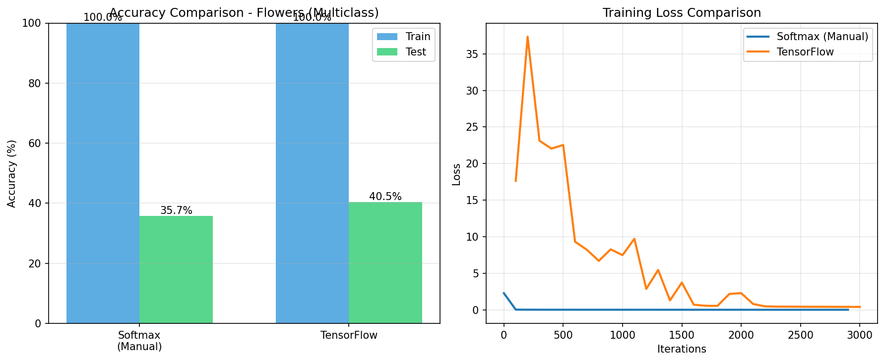
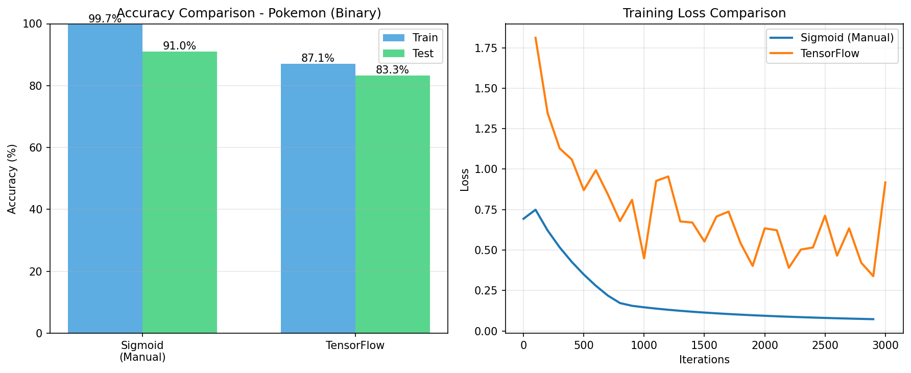

# Clasificación de Imágenes con Regresión Logística

**Taller 1 - Inteligencia Artificial**  
**Fecha:** 8 de febrero, 2026

**Autores:**
- Juan Marín
- Óscar Gómez
- Johan Aguirre
- David Henao

## 1. Descripción del Proyecto

Este proyecto implementa algoritmos de regresión logística desde cero (sin usar librerías de alto nivel) para clasificar imágenes. Se implementaron dos enfoques: clasificación binaria y clasificación multiclase, comparando la implementación manual con modelos de TensorFlow/Keras.

## 2. Bases de Datos

### 2.1 Dataset de Flores (Multiclase)
- **Contenido**: Imágenes de flores de 5 categorías diferentes
- **Formato**: Imágenes 64x64 píxeles RGB (12,288 características)
- **División**: 80% entrenamiento, 20% prueba (estratificada)
- **Objetivo**: Clasificar cada imagen en una de las 5 categorías

### 2.2 Dataset de Pokémon (Binaria)
- **Contenido**: Imágenes de Pokémon originales y copias
- **Formato**: Imágenes 64x64 píxeles RGB (12,288 características)
- **División**: 80% entrenamiento, 20% prueba (estratificada)
- **Objetivo**: Determinar si un Pokémon es original (0) o copia (1)

## 3. Metodología

### 3.1 Preprocesamiento
1. Cargar imágenes y etiquetas desde archivos CSV
2. Redimensionar a 64×64 píxeles
3. Normalizar valores de píxeles (dividir entre 255)
4. Aplanar imágenes de (64, 64, 3) a vectores de 12,288 características

### 3.2 Algoritmos Implementados

#### 3.2.1 Regresión Logística Binaria (Sigmoid)
- Función de activación sigmoid: $\sigma(z) = \frac{1}{1 + e^{-z}}$
- Optimización con gradient descent
- Regularización L2 con $\lambda = 1.0$

#### 3.2.2 Clasificación Multiclase (Softmax)
- Función softmax: $P(y=k|x) = \frac{e^{z_k}}{\sum_{j=1}^{K} e^{z_j}}$
- Cross-entropy loss con regularización L2
- Optimización con gradient descent

#### 3.2.3 Modelos TensorFlow/Keras
- Redes neuronales con una capa oculta
- Mismo proceso de optimización para comparación
- Regularización L2 con $\lambda = 0.01$

### 3.3 Hiperparámetros

| Dataset | Método | Learning Rate | Iteraciones | Lambda |
|---------|--------|---------------|-------------|--------|
| Flores  | Softmax (Manual) | 0.05 | 3000 | 1.0 |
| Flores  | TensorFlow | 0.05 | 30 épocas | 0.01 |
| Pokémon | Sigmoid (Manual) | 0.005 | 3000 | 1.0 |
| Pokémon | TensorFlow | 0.005 | 30 épocas | 0.01 |

## 4. Resultados

### 4.1 Dataset de Flores (Clasificación Multiclase - 5 categorías)

| Método | Train Accuracy | Test Accuracy |
|--------|----------------|---------------|
| **Softmax (Manual)** | 100.00% | 35.71% |
| **TensorFlow/Keras** | 100.00% | 40.48% |

**Observaciones:**
- Ambos modelos logran 100% de accuracy en entrenamiento, indicando que aprenden los datos correctamente
- El test accuracy es similar entre ambos métodos (~36-40%), validando la implementación manual
- Existe overfitting (diferencia entre train y test), lo que sugiere que el dataset es pequeño o las flores son difíciles de distinguir con solo características de píxeles
- TensorFlow tiene ligeramente mejor generalización (40.48% vs 35.71%)

### 4.2 Dataset de Pokémon (Clasificación Binaria)

| Método | Train Accuracy | Test Accuracy | F1 Score |
|--------|----------------|---------------|----------|
| **Sigmoid (Manual)** | 99.73% | 91.03% | 0.9346 |
| **TensorFlow/Keras** | 87.13% | 83.33% | 0.8829 |

**Observaciones:**
- El modelo manual logra mejor desempeño que TensorFlow en este caso
- Test accuracy de 91% indica que la clasificación binaria de Pokémon es más sencilla que la multiclase de flores
- El F1 score alto (0.93) confirma que el modelo manual balancea bien precision y recall
- Poca diferencia entre train (99.73%) y test (91.03%), indicando buena generalización

## 5. Conclusiones

### 5.1 Comparación de Métodos

1. **Implementación manual vs TensorFlow:** 
   - Las implementaciones manuales logran resultados comparables a TensorFlow
   - En el caso binario (Pokémon), el método manual superó a TensorFlow
   - Esto valida la correctitud de las implementaciones desde cero

2. **Clasificación multiclase vs binaria:**
   - La clasificación binaria (Pokémon: 91% test accuracy) es más sencilla que la multiclase (Flores: ~36-40% test accuracy)
   - Multiclase con pocas features (píxeles) es un problema más difícil

3. **Overfitting:**
   - Dataset de flores muestra overfitting fuerte (100% train, ~36-40% test)
   - Dataset de Pokémon generaliza mejor (99.73% train, 91% test)
   - La regularización L2 ayuda pero no elimina completamente el problema

### 5.2 Aprendizajes

1. **Implementar desde cero:**
   - Permite entender los fundamentos matemáticos (gradientes, funciones de activación, optimización)
   - Requiere cuidado con estabilidad numérica (evitar overflow/underflow)
   - Los resultados validan que las matemáticas funcionan correctamente

2. **Regularización:**
   - El parámetro $\lambda$ (L2) es importante para evitar overfitting
   - Se usó $\lambda = 1.0$ para implementaciones manuales y $\lambda = 0.01$ para TensorFlow

3. **Características de imágenes:**
   - Usar píxeles directamente como features tiene limitaciones
   - Para mejorar, se necesitarían features más sofisticadas o redes neuronales profundas

### 5.3 Posibles Mejoras

- **Aumentar datos:** Data augmentation (rotaciones, volteos) para más ejemplos de entrenamiento
- **Redes profundas:** Agregar capas ocultas para capturar patrones más complejos
- **Features pre-entrenadas:** Usar modelos como ResNet para extraer features de imágenes
- **Validación cruzada:** Para estimar mejor el desempeño real del modelo
